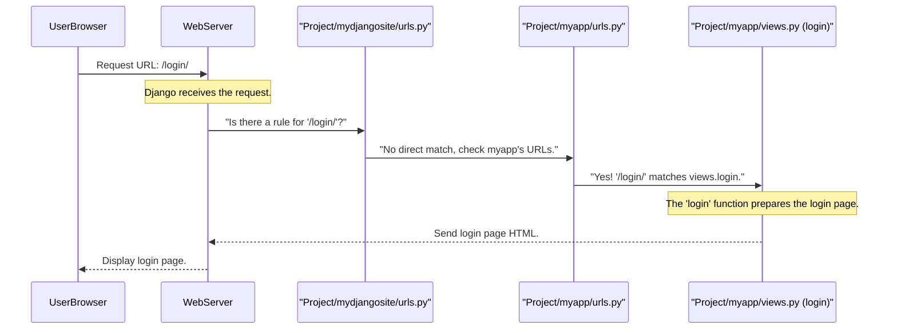

# Chapter 1: URL Routing

Welcome to the `Engineering-Seat-Allocation` project! In this chapter, we're going to start our journey by understanding a fundamental concept called "URL Routing". Think of it as the website's built-in GPS or address book.

### What is URL Routing? (The Website's GPS)

Imagine you want to go to a specific store in a big city. You type its address into your GPS. The GPS then figures out the best way to get you there.

Similarly, when you type a web address (like `www.ourseatallocation.com/login`) into your browser, your computer sends that address, called a **URL** (Uniform Resource Locator), to our website. The website needs a way to figure out *what page you want to see* based on that URL.

This is exactly what **URL Routing** does! It takes the URL you typed and directs it to the correct "receptionist" (which we call a **view function** in web development) that knows how to handle your specific request.

For example, when you go to `/login`, URL Routing ensures you land on the login page and not, for instance, the registration page. It's the system that ensures every unique address leads to the right place and performs the right action.

### Our First Stop: The `/login` Page

Let's use a common example from our project: accessing the login page.
When a user wants to log in, they'll type something like `/login` into their browser's address bar. How does our `Engineering-Seat-Allocation` website know to show the login form?

This is where URL Routing steps in. It has a "map" that says: "If someone asks for `/login`, I should show them the login form."

### How Does it Work? The "Address Book" in Code

In Django (the web framework our project uses), URL Routing is set up in special Python files. There are usually two main places where URLs are defined:

1.  **Project-level URLs:** This is like the main entry point to our entire website. It tells Django which "app" (a smaller part of our project, like `myapp`) should handle certain types of URLs.
2.  **App-level URLs:** Each "app" then has its own "address book" to handle the specific pages and actions within that app.

Let's look at the project's main URL file first.

#### Step 1: The Main Project Map (`Project/mydjangosite/urls.py`)

This file is the *first* place Django looks when a request comes in. It's like the main highway map.

```python
# File: Project/mydjangosite/urls.py
from django.contrib import admin
from django.urls import include, path # We need 'include' here!

urlpatterns = [
    path('admin/', admin.site.urls), # A route for Django's admin panel
    path('',include('myapp.urls')),  # Our key line!
]
```

**What's happening here?**

*   `path('admin/', admin.site.urls)`: This line says, "If the URL starts with `admin/`, then let Django's built-in admin system handle it."
*   `path('',include('myapp.urls'))`: This is the crucial line for our project. It says, "For *any other URL* (represented by `''`, which means the 'root' or beginning of the URL), go and look for more routing rules inside the `myapp/urls.py` file."
    *   `include('myapp.urls')` is like saying, "Hey, `myapp` has its own detailed map. Let's send requests over there for more specific directions!"

Now that the request is routed to `myapp`, let's see what `myapp/urls.py` looks like.

#### Step 2: The App's Detailed Map (`Project/myapp/urls.py`)

This file contains the specific routes for all the features within our `myapp`. It's where we define the exact path to our login page.

```python
# File: Project/myapp/urls.py
from django.urls import path
from . import views # We import all the "receptionists" from views.py

urlpatterns = [
    # ... (other routes) ...
    path('login/',views.login,name='login'), # Our login route!
    # ... (more routes) ...
]
```

**Let's break down this `path` line:**

*   `path('login/', views.login, name='login')`: This is a single routing rule, or a "route."
    *   `'login/'`: This is the **URL pattern**. If a user types `/login/` (after the main domain), this rule will match.
    *   `views.login`: This tells Django *which* function, located in our `views.py` file, should be called to handle this URL. This function is our "receptionist" for the login page. We'll explore these "receptionists" in the next chapter, [Web Request Handling (Views)](02_web_request_handling__views__.md).
    *   `name='login'`: This is a helpful shortcut name. Instead of always typing `'/login/'` in our code, we can just refer to this route by its name, `login`. This makes our code more organized!

So, when you type `/login/`, Django's routing system finds this line, and it knows to call the `login` function from `views.py`.

#### Step 3: The "Receptionist" (`Project/myapp/views.py`)

The `views.py` file contains the actual Python functions that perform actions and prepare responses for each specific URL. For our `/login/` example, the `views.login` function is called.

```python
# File: Project/myapp/views.py
from django.shortcuts import render # A helper to send back web pages

# function for calling login template for user
def login(request):
    # This function receives the web request
    # It prepares the login page (an HTML file)
    return render(request,"myapp/login.html",{})
```

**What does this `login` function do?**

*   `def login(request):`: This defines our "receptionist" function. It always takes at least one argument, `request`, which contains details about the incoming web request (like who sent it, what data they sent, etc.).
*   `return render(request,"myapp/login.html",{})`: This line tells Django to "render" (or generate) an HTML page using the `myapp/login.html` template and send it back to the user's browser. The `{}` is for sending extra data to the page, but for now, it's empty.

And just like that, the login page appears in the user's browser!

### The Journey of a URL: A Quick Overview

Let's put it all together. When a user's browser asks for `www.ourseatallocation.com/login/`:



### Conclusion

In this chapter, we've learned that URL Routing is the essential "GPS" of our website. It translates the web addresses (URLs) typed by users into specific actions performed by our application. We saw how the project-level `urls.py` points to the app-level `urls.py`, which then maps specific URL patterns (like `login/`) to corresponding "receptionist" functions (like `views.login`).

Understanding this routing mechanism is the first step to building any web application. Next, we'll dive deeper into these "receptionist" functions, called **view functions**, to see exactly what they do once they receive a request!

[Next Chapter: Web Request Handling (Views)](02_web_request_handling__views__.md)

---

<sub></sub> <sub><sup>**References**: [[1]](https://github.com/itz-me-pandian/Engineering-Seat-Allocation/blob/1a0dba2424984bbc23ebdfb95b2ed13cd798a0ac/Project/myapp/urls.py), [[2]](https://github.com/itz-me-pandian/Engineering-Seat-Allocation/blob/1a0dba2424984bbc23ebdfb95b2ed13cd798a0ac/Project/myapp/views.py), [[3]](https://github.com/itz-me-pandian/Engineering-Seat-Allocation/blob/1a0dba2424984bbc23ebdfb95b2ed13cd798a0ac/Project/mydjangosite/urls.py)</sup></sub>