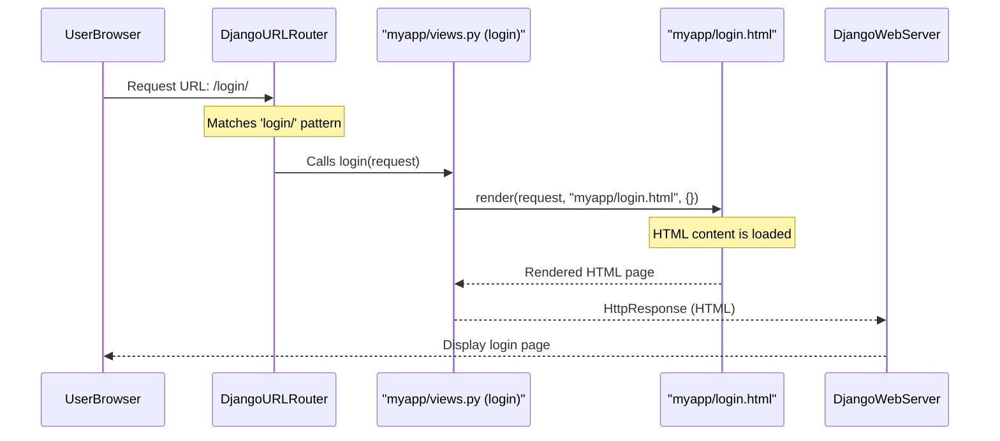

# Chapter 2: Web Request Handling (Views)

Welcome back, future engineers! In [Chapter 1: URL Routing](01_url_routing_.md), we learned how our `Engineering-Seat-Allocation` website's "GPS" (URL Routing) takes a web address (URL) and directs it to the correct "receptionist." These "receptionists" are what we call **view functions**.

Now, in this chapter, we're going to dive deep into these view functions. They are where the real work happens!

### What Problem Do Views Solve? (The Website's Brain)

Imagine URL Routing is like the front desk of a busy office. It directs visitors to the right department. But once you're in the department, someone actually needs to *do* something for you.

That's the job of a **view function**. When you visit `/login`, the URL router knows to send you to the `login` view function. But what does `login` *do*?

*   Does it simply show you a page?
*   Does it check if you submitted a form?
*   Does it need to fetch data from a database (like your username and password)?
*   Does it need to send an email or calculate something?

All these actions, this core logic, and the decision of what page to show back to the user – that's what view functions handle. They are the "brains" of our website, processing requests and generating responses.

Let's continue with our login page example to see how a view function works in practice.

### What is a View Function? (The Dedicated Receptionist)

A view function is a standard Python function that takes a web request as input and returns a web response.

Think of it like this:

1.  **Receives the Request:** A user's browser sends a `request` (e.g., "I want to see the login page," or "Here's my login form data").
2.  **Processes Logic:** The view function looks at the `request`.
    *   If it's just asking for a page, it prepares that page.
    *   If it contains form data, it processes that data (e.g., checks credentials, saves to a database).
    *   It might perform calculations, check permissions, or interact with other parts of the application.
3.  **Returns a Response:** Finally, the view function sends something back to the user's browser. This is usually an HTML web page, but it could also be a redirect to another page, an error message, or some data.

#### The `request` Object

Every view function in Django takes at least one argument, conventionally named `request`. This `request` object is a powerful tool that holds all the information about the incoming web request:

*   **Method:** Was it a `GET` request (just asking for a page) or a `POST` request (submitting data, like a form)?
*   **Data:** If it was a `POST` request, `request.POST` contains the data submitted in the form.
*   **User Information:** If the user is logged in, `request.user` has details about them.
*   **Session Information:** Data that persists across multiple visits (like if you're logged in).

#### Returning a Response: `render()` and `redirect()`

The main goal of a view is to return a `HttpResponse` object. Django provides several helper functions to make this easy:

*   **`render(request, 'template_name.html', context_data)`:** This is the most common. It combines a `request` object with an HTML template file and some optional data (`context_data`) to generate a complete HTML page. This page is then sent back as the response.
*   **`redirect('url_name')` or `redirect('/some-path/')`:** This tells the user's browser to go to a different URL. It's useful after successfully processing a form (e.g., after logging in, redirect to the user's profile).

### Our Login Page View: A Simple Example

Let's revisit the `login` view function from `Project/myapp/views.py` that we saw in [Chapter 1: URL Routing](01_url_routing_.md):

```python
# File: Project/myapp/views.py (simplified)
from django.shortcuts import render # Don't forget to import this!

# function for calling login template for user
def login(request):
    # This view function handles requests for the /login/ URL.
    # It simply prepares and sends back the login HTML page.
    return render(request, "myapp/login.html", {})
```

**What's happening here?**

1.  `def login(request):`: This defines our view function, named `login`. It accepts the `request` object.
2.  `return render(request, "myapp/login.html", {})`: This is the core line.
    *   It calls the `render` helper function.
    *   It passes the `request` object it received.
    *   It specifies `myapp/login.html` as the HTML template file to use.
    *   `{}` is an empty dictionary for now; it's where we would pass dynamic data to the template if needed (e.g., `{'username': 'Alice'}`).

This view function is very straightforward: it just displays a static HTML page.

Let's look at a simplified `login.html` template file (only the relevant parts):

```html
<!-- File: Project/myapp/templates/myapp/login.html (simplified) -->
<!DOCTYPE html>
<html lang="en">
<head>
    <title>Login</title>
</head>
<body>
    <div class="container">
        <h1>Login with your details !</h1>
        <form method="POST" action="">
            
            <label for="name">Candidate Name:</label>
            <input type="text" id="name" name="name" required>
            
            <!-- ... more input fields for contact number and password ... -->
            
            <input type="submit" value="Login">
            <!-- ... other buttons ... -->
        </form>
    </div>
</body>
</html>
```

This HTML defines the structure of the login page, including a form that will submit data using the `POST` method to the URL named `login_check`.

### The Journey of a Web Request (Views in Action)

Let's see the full picture of how a request travels from the user's browser, through our URL routing, and into a view function:



### More Complex View Functions: Handling Data and Logic

Not all views are as simple as just showing a page. Many views need to:

1.  **Receive form data** (e.g., a login form, a registration form).
2.  **Process that data** (e.g., save to a database, perform calculations, send an email, check credentials).
3.  **Make decisions** (e.g., if login is successful, redirect; if not, show an error).

Let's look at some other crucial view functions from our `myapp/views.py` file to understand these scenarios.

#### Example 1: Processing Form Data (`insertuser`)

When a new user registers, they fill out a form (defined in `userreg.html`). This form's data is sent to the `insertuser` view.

```python
# File: Project/myapp/views.py (simplified insertuser)
from django.shortcuts import render, redirect
from django.contrib import messages
from .models import User # We'll learn about models in the next chapter!
import random
from django.core.mail import send_mail # For sending OTP

# (Other helper functions like calc() would be here)

def insertuser(request):
    if request.method == 'POST': # Check if data was submitted via POST
        # 1. Receive form data using request.POST.get()
        vuid = request.POST.get('tuid')
        vuname = request.POST.get('tuname')
        vuemail = request.POST.get('tuemail')
        vucaste = request.POST.get('tucaste')
        vuyear = request.POST.get('tuyear')
        # ... and so on for all form fields ...

        # 2. Perform logic (e.g., calculations, generating password)
        vtot = int(request.POST.get('tum1')) + int(request.POST.get('tum2')) # Simplified
        vcut = round(int(request.POST.get('tum1')) + (int(request.POST.get('tum2')))/2, 2) # Simplified
        vupass = vuname[:4].lower() + vuyear # Generate simple password
        
        # 3. Decision making & further actions
        try:
            # Check if user already exists
            User.objects.get(id=vuid)
            messages.error(request, 'Already registered with this contact number!')
            return render(request, 'myapp/userreg.html', {'messages': messages.get_messages(request)})
        except User.DoesNotExist:
            # User doesn't exist, proceed with registration logic
            otp = str(random.randint(1000, 9999))
            request.session['otp'] = otp # Store OTP in session for later verification
            # ... store other user data in session ...
            
            send_mail( # Send OTP to user's email
                'OTP for Validating',
                f'Your OTP is: {otp}',
                'noreply@example.com',
                [vuemail],
                fail_silently=True,
            )
            return render(request, "myapp/otp.html", {'user': vuname}) # Show OTP verification page
    # If not a POST request, just show the registration form (though it's handled by userreg view directly)
    return redirect('userreg')
```

**What's new here?**

*   `if request.method == 'POST':`: This is crucial! It checks if the request is sending data (like a submitted form) rather than just asking for a page.
*   `request.POST.get('field_name')`: This is how we extract the data submitted by the user from the form.
*   `User.objects.get(id=vuid)`: This line interacts with our database ([Django Models (User & Student)](03_django_models__user___student__.md) will cover this). It tries to find a user with the given `id`.
*   `try...except`: This handles potential errors, like if a user with that `id` doesn't exist.
*   `messages.error(request, '...')`: This allows us to send temporary messages (like "Registration successful!" or "Invalid details!") back to the user on the next page.
*   `request.session['otp'] = otp`: This saves the generated OTP in the user's "session" – a temporary storage on the server associated with their browser. This way, we can verify it later.
*   `send_mail(...)`: This demonstrates that a view can perform external actions like sending emails.
*   `return render(request, "myapp/otp.html", {'user': vuname})`: Instead of the registration page, it renders a different template (`otp.html`) to prompt for OTP verification.

This `insertuser` view clearly shows how a view function acts as the central hub for receiving data, applying business logic, and deciding the next step.

#### Example 2: Displaying Dynamic Data (`viewprofile`)

After a user logs in, we want to show them their personal profile. This involves fetching *their specific* data from the database.

```python
# File: Project/myapp/views.py (simplified view)
from django.shortcuts import render, get_object_or_404
from .models import User # Again, models are coming soon!

# function for calling template for displaying a particular candidate
def view(request, id): # 'id' comes from the URL (e.g., /editprofile/1234567890)
    # 1. Fetch data for a specific user from the database
    # get_object_or_404 is a shortcut: it gets the object or shows a 404 error
    users = get_object_or_404(User, id=id) 
    
    # 2. Prepare the data to be sent to the template
    context = {'user': users} # We create a dictionary to hold our user object

    # 3. Render the profile page, passing the user data
    return render(request, "myapp/viewprofile.html", context)
```

**Key takeaways:**

*   `def view(request, id):`: Notice `id` here. This view function expects an `id` as part of its URL (e.g., `/editprofile/1234567890`). The URL router passes this `id` as an argument to the view.
*   `get_object_or_404(User, id=id)`: This is how we retrieve specific data from our `User` "model" (our representation of database tables). It finds the user whose `id` matches the `id` from the URL.
*   `{'user': users}`: This dictionary is the `context` that gets passed to the template. Inside `viewprofile.html`, we can now access this user's data using `{{ user.uname }}`, `{{ user.uemail }}`, etc.

The `viewprofile.html` template then uses this `user` data to display a personalized page:

```html
<!-- File: Project/myapp/templates/myapp/viewprofile.html (simplified) -->
<!DOCTYPE html>
<html lang="en">
<body>
    <div class="container">
        <h1>Candidate Information</h1>
        <div class="form-group">
            <div class="form-label welcome-message">HELLO! THIS IS <span style="text-transform: uppercase;">{{ user.uname }} </span>!!</div><br><br>
        </div>
        <div class="form-group">
            <div class="form-label">Contact Number</div>
            <div class="colon">:</div>
            <div class="form-input">{{ user.id }}</div>
        </div>
        <!-- ... display other user details using {{ user.field_name }} ... -->
    </div>
</body>
</html>
```

This clearly shows how views fetch dynamic data and use it to create personalized web pages.

#### Example 3: Redirecting to Another Page (`deleteprofile`)

Sometimes, after an action is completed, we don't need to show a new page directly but rather send the user back to a previous page or a success page.

```python
# File: Project/myapp/views.py (simplified deleteprofile)
from django.shortcuts import redirect
from .models import User, Student

# function for deleting a particular user from the database in the admin page
def deleteprofile(request, id): # 'id' from the URL (e.g., /deleteprofile/1234567890)
    # 1. Find the user (and student choices if they exist)
    us = User.objects.get(id=id)
    try:
        us1 = Student.objects.get(id=id) # Student choices might exist
        us1.delete()
    except Student.DoesNotExist:
        pass # No student choices to delete
        
    # 2. Delete the user from the database
    us.delete()
    
    # 3. Redirect the user back to the 'viewusers' page
    return redirect("/viewusers")
```

**What's happening here?**

*   `us.delete()`: This removes the `User` object from the database.
*   `return redirect("/viewusers")`: Instead of rendering an HTML page, this line tells the user's browser to immediately go to the `/viewusers` URL. This is a common pattern after a "delete" or "save" action, preventing users from accidentally re-submitting actions.

### Conclusion

View functions are the heart of web applications. They are the "receptionists" or "orchestrators" that receive incoming requests, execute the necessary business logic (like calculations, database interactions, sending emails), and ultimately decide what response to send back to the user. We've seen how they can:

*   Display simple static pages using `render()`.
*   Process form data from `POST` requests and apply logic.
*   Fetch and display dynamic data from a database.
*   Redirect users to other pages using `redirect()`.

Understanding views is key to building interactive and dynamic websites. In the next chapter, we'll dive deeper into how Django structures and interacts with the database using **Models**, which are heavily used by our view functions to store and retrieve data!

[Next Chapter: Django Models (User & Student)](03_django_models__user___student__.md)

---

 <sub><sup>**References**: [[1]](https://github.com/itz-me-pandian/Engineering-Seat-Allocation/blob/1a0dba2424984bbc23ebdfb95b2ed13cd798a0ac/Project/myapp/templates/myapp/adlogin.html), [[2]](https://github.com/itz-me-pandian/Engineering-Seat-Allocation/blob/1a0dba2424984bbc23ebdfb95b2ed13cd798a0ac/Project/myapp/templates/myapp/choice.html), [[3]](https://github.com/itz-me-pandian/Engineering-Seat-Allocation/blob/1a0dba2424984bbc23ebdfb95b2ed13cd798a0ac/Project/myapp/templates/myapp/index.html), [[4]](https://github.com/itz-me-pandian/Engineering-Seat-Allocation/blob/1a0dba2424984bbc23ebdfb95b2ed13cd798a0ac/Project/myapp/templates/myapp/login.html), [[5]](https://github.com/itz-me-pandian/Engineering-Seat-Allocation/blob/1a0dba2424984bbc23ebdfb95b2ed13cd798a0ac/Project/myapp/templates/myapp/otp.html), [[6]](https://github.com/itz-me-pandian/Engineering-Seat-Allocation/blob/1a0dba2424984bbc23ebdfb95b2ed13cd798a0ac/Project/myapp/templates/myapp/userreg.html), [[7]](https://github.com/itz-me-pandian/Engineering-Seat-Allocation/blob/1a0dba2424984bbc23ebdfb95b2ed13cd798a0ac/Project/myapp/templates/myapp/viewprofile.html), [[8]](https://github.com/itz-me-pandian/Engineering-Seat-Allocation/blob/1a0dba2424984bbc23ebdfb95b2ed13cd798a0ac/Project/myapp/templates/myapp/viewusers.html), [[9]](https://github.com/itz-me-pandian/Engineering-Seat-Allocation/blob/1a0dba2424984bbc23ebdfb95b2ed13cd798a0ac/Project/myapp/views.py)</sup></sub>