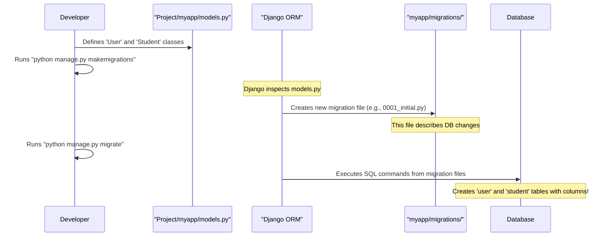

# Chapter 3: Django Models (User & Student)

Welcome back, future engineers! In [Chapter 2: Web Request Handling (Views)](02_web_request_handling__views__.md), we learned how our "receptionist" view functions process web requests and return responses. We even saw how views could save data (like a new user's registration) or retrieve data (like a user's profile) to and from a database.

But have you ever wondered how Django knows *what kind* of data to store? Where does it get the blueprint for an applicant's marks, or their chosen courses? That's exactly the problem **Django Models** solve!

### What Problem Do Models Solve? (The Website's Data Blueprint)

Imagine you're building a new house. Before you start pouring concrete or nailing boards, you need a detailed blueprint. This blueprint specifies everything: how many rooms, where the windows go, what materials to use, etc.

Similarly, our `Engineering-Seat-Allocation` project needs to store a lot of information about applicants:

*   Their name, email, contact number.
*   Their marks in different subjects, caste, and calculated cutoff.
*   Their chosen course preferences (e.g., "Computer Science," "Electronics").
*   The final course they are allotted.

Without a clear structure, this data would be a mess! This is where **Django Models** come in. They are the **blueprints** that define *how* our application's data is structured and stored in the database.

Think of a model as a custom-designed form or a table definition that tells Django exactly what pieces of information to collect and manage for each applicant.

### What are Django Models? (Your Data's Design Document)

A Django Model is a Python class that represents a table in your database. Each attribute (or variable) in the model class represents a column in that table. Django takes these Python classes and, behind the scenes, translates them into database tables.

This magical translation is done by Django's **Object-Relational Mapper (ORM)**. It lets you interact with your database using plain Python code, without writing complex SQL queries yourself!

Our project uses two main models to manage applicant information: the `User` model and the `Student` model.

#### 1. The `User` Model: Applicant's Personal & Academic Details

The `User` model is designed to hold an applicant's personal information and academic scores.

**Purpose:** To store details like name, contact number (used as `id`), email, caste, marks in various subjects, calculated total, cutoff, and their rank.

Let's look at a simplified version of our `User` model from `Project/myapp/models.py`:

```python
# File: Project/myapp/models.py (Simplified User Model)
from django.db import models

class User(models.Model): # Inherits from models.Model
    uname = models.CharField(max_length=30)  # Name of the applicant
    upass = models.CharField(max_length=25, default='') # Password
    uemail = models.EmailField()             # Email address
    ucaste = models.CharField(max_length=3, default='OC') # Caste (e.g., 'OC', 'BC')
    ucutoff = models.DecimalField(max_digits=5, decimal_places=2, default=0.00) # Calculated cutoff
    urank = models.PositiveIntegerField(default=0) # Their calculated rank

    def __str__(self):
        return self.uname # How a User object is displayed as text

    class Meta:
        db_table = "user" # The actual table name in the database
```

**Breaking it down:**

*   `class User(models.Model):`: This tells Django that `User` is a model and should be connected to the database.
*   `uname = models.CharField(max_length=30)`: This defines a field (a column in the database table) named `uname`. It will store text, up to 30 characters long.
*   `uemail = models.EmailField()`: This is a special field for email addresses.
*   `ucaste = models.CharField(max_length=3, default='OC')`: Another character field, with a default value of 'OC' if not specified.
*   `ucutoff = models.DecimalField(...)`: This stores numbers with decimal places, suitable for cutoff marks. `max_digits` is the total number of digits, and `decimal_places` is how many are after the decimal point.
*   `urank = models.PositiveIntegerField(default=0)`: Stores positive whole numbers for the rank.
*   `def __str__(self):`: This is a standard Python method that defines how an object of `User` is represented as a string. It's helpful when you see `User` objects in the Django admin panel or in print statements.
*   `class Meta: db_table = "user"`: This is a special inner class that tells Django to name the database table associated with this model `"user"`. If you don't specify this, Django often generates a name like `myapp_user`.

#### 2. The `Student` Model: Course Preferences & Allotment

The `Student` model is crucial for storing an applicant's preferred courses and the final course they are allotted. This data is distinct from their personal details in the `User` model.

**Purpose:** To store course choices (`pref1`, `pref2`, `pref3`) and the outcome of the seat allocation (`allotted_course`).

Here's a simplified view of our `Student` model from `Project/myapp/models.py`:

```python
# File: Project/myapp/models.py (Simplified Student Model)
from django.db import models

class Student(models.Model):
    name = models.CharField(max_length=100) # Student's name (for easy reference)
    marks = models.DecimalField(max_digits=5, decimal_places=2) # Their cutoff marks
    rank = models.PositiveSmallIntegerField(default=0) # Their rank
    pref1 = models.CharField(max_length=250) # First course preference
    pref2 = models.CharField(max_length=250) # Second course preference
    pref3 = models.CharField(max_length=250) # Third course preference
    allotted_course = models.CharField(max_length=250, default='Not allotted') # Final course

    def __str__(self):
        return self.name

    class Meta:
        db_table = "student" # The actual table name in the database
```

**Key fields:**

*   `name`, `marks`, `rank`: These fields are duplicated from `User` to `Student`. While not ideal in a perfectly normalized database design (a concept for later!), it's done here for simplicity and easier access to related data when processing seat allocations.
*   `pref1`, `pref2`, `pref3`: These `CharField` fields store the names of the engineering branches the student prefers (e.g., "BME", "IT", "CSE").
*   `allotted_course`: This `CharField` will store the final course assigned to the student, defaulting to "Not allotted" initially.

### How Models Help Our Views (Connecting Python to Your Data)

In [Chapter 2: Web Request Handling (Views)](02_web_request_handling__views__.md), we saw `views.py` functions like `insertuser` and `view` interacting with data. These interactions are made easy by models!

Instead of writing SQL like `INSERT INTO user (...) VALUES (...)` or `SELECT * FROM user WHERE id = ...`, Django models let us do this with simple Python:

#### Example 1: Creating a new `User` (from `insertuser` view)

When a new user registers, the `insertuser` view creates a new `User` object and saves it:

```python
# File: Project/myapp/views.py (Simplified insertuser)
from django.shortcuts import render
from .models import User # Import the User model!

def insertuser(request):
    if request.method == 'POST':
        # ... (extract data from request.POST) ...
        vuid = request.POST.get('tuid')
        vuname = request.POST.get('tuname')
        vuemail = request.POST.get('tuemail')
        # ... and so on ...

        # Create a new User object (a Python representation of a database row)
        us = User(id=vuid, uname=vuname, uemail=vuemail, # Assigning values
                  # ... other fields ...
                 )
        us.save() # Tell Django to save this object to the database!
        # ... (send OTP, render new page) ...
    # ...
```

*   `from .models import User`: This line is crucial! It imports our `User` model class so we can use it.
*   `us = User(...)`: This creates a new `User` *object* in Python. It's not yet in the database.
*   `us.save()`: This is the magic! Django's ORM takes this Python object `us` and translates it into an `INSERT` command to add a new row to the `user` table in the database.

#### Example 2: Getting a `User`'s profile (from `view` view)

When we want to display a user's profile, the `view` function retrieves a specific `User` object from the database:

```python
# File: Project/myapp/views.py (Simplified view)
from django.shortcuts import render, get_object_or_404
from .models import User # Import the User model!

def view(request, id): # 'id' comes from the URL
    # Find a User object where its 'id' field matches the 'id' from the URL
    users = get_object_or_404(User, id=id) 
    
    context = {'user': users} # Pass the fetched User object to the template
    return render(request, "myapp/viewprofile.html", context)
```

*   `User.objects.get(id=id)` (simplified by `get_object_or_404`):
    *   `User.objects`: `objects` is Django's default Manager. It's the primary way to interact with the database (e.g., to query, create, update, or delete objects).
    *   `.get(id=id)`: This tells the manager to find *one* `User` object where the `id` field in the database matches the `id` value passed to the view function. If no user or more than one user is found, it raises an error (or a 404 if using `get_object_or_404`).
*   The `users` variable now holds a `User` *object*, containing all the data for that specific applicant, which can then be easily displayed in the HTML template (e.g., `{{ user.uname }}`).

### How Do Models Become Database Tables? (Under the Hood)

You define Python classes for your models, but your database (like MySQL or PostgreSQL) only understands tables, rows, and columns. How do these connect?

This process involves **Migrations**:



1.  **Define Models**: You write your `User` and `Student` classes in `Project/myapp/models.py`.
2.  **Make Migrations**: When you run `python manage.py makemigrations myapp`, Django looks at your `models.py` file. It compares your current model definitions with the last "blueprint" it had for your database. If it sees new models (like `User` and `Student`) or changes to existing ones, it generates a "migration file" (a Python file in `myapp/migrations/`). This file is essentially a set of instructions (in Python) that Django can use to change your database schema.
    *   You can see example migration files like `Project/myapp/migrations/0001_initial.py` and `Project/myapp/migrations/0014_student.py` in the project structure. These files are automatically generated by Django!
3.  **Migrate**: When you run `python manage.py migrate`, Django goes through these migration files. For each instruction, it generates and executes the necessary SQL commands to create or modify tables in your actual database.
    *   For instance, it will create a table named `user` with columns for `uname`, `uemail`, `ucaste`, `ucutoff`, etc., and a table named `student` with columns for `name`, `marks`, `pref1`, `allotted_course`, etc.

Once these database tables are created, your views can use `User.objects.get()`, `Student.objects.save()`, and other ORM methods to interact with the data directly through Python objects!

### Conclusion

Django Models are the backbone of how our `Engineering-Seat-Allocation` project stores and manages its data. They act as blueprints that define the structure of information (like applicant details and course preferences) in our database. By defining `User` and `Student` models, we can interact with our database using simple Python code, which our view functions use extensively to register new users, fetch profiles, and save course choices. The powerful Django ORM handles all the complex translation between our Python models and the underlying database tables.

In the next chapter, we'll see how this stored `User` and `Student` data is used to implement the [Student Ranking System](04_student_ranking_system_.md)!

[Next Chapter: Student Ranking System](04_student_ranking_system_.md)

---

<sub><sup>**References**: [[1]](https://github.com/itz-me-pandian/Engineering-Seat-Allocation/blob/1a0dba2424984bbc23ebdfb95b2ed13cd798a0ac/Project/myapp/admin.py), [[2]](https://github.com/itz-me-pandian/Engineering-Seat-Allocation/blob/1a0dba2424984bbc23ebdfb95b2ed13cd798a0ac/Project/myapp/all.py), [[3]](https://github.com/itz-me-pandian/Engineering-Seat-Allocation/blob/1a0dba2424984bbc23ebdfb95b2ed13cd798a0ac/Project/myapp/migrations/0001_initial.py), [[4]](https://github.com/itz-me-pandian/Engineering-Seat-Allocation/blob/1a0dba2424984bbc23ebdfb95b2ed13cd798a0ac/Project/myapp/migrations/0014_student.py), [[5]](https://github.com/itz-me-pandian/Engineering-Seat-Allocation/blob/1a0dba2424984bbc23ebdfb95b2ed13cd798a0ac/Project/myapp/models.py), [[6]](https://github.com/itz-me-pandian/Engineering-Seat-Allocation/blob/1a0dba2424984bbc23ebdfb95b2ed13cd798a0ac/Project/myapp/views.py)</sup></sub>