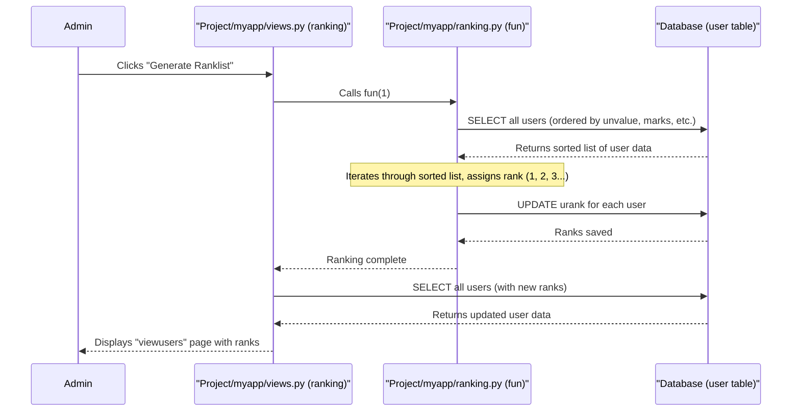

# Chapter 4: Student Ranking System

Welcome back, future engineers! In [Chapter 3: Django Models (User & Student)](03_django_models__user___student__.md), we learned how our `Engineering-Seat-Allocation` project stores applicant information (like names, marks, and preferences) in our database using `User` and `Student` models. We now have a clear blueprint for all the data!

But simply having data isn isn't enough. Imagine a long line of students waiting for college admission. Who gets in first? How do we decide? That's exactly the problem the **Student Ranking System** solves!

### What Problem Does the Student Ranking System Solve? (The Admission Queue)

Think of the Student Ranking System as the "admission queue organizer." When many students apply for a limited number of seats, we need a fair and systematic way to decide their order. This system:

1.  **Processes all applicant data**: It looks at every registered student's academic scores, calculated cutoff marks, and even caste information.
2.  **Calculates a "merit value"**: It uses a formula to combine these details into a single "merit" score, which might include special adjustments (like caste-based normalization).
3.  **Assigns a definitive rank**: Based on these merit values, it gives each applicant a unique position in the admission queue (Rank 1, Rank 2, and so on).

This rank is incredibly important because it directly determines a student's eligibility for the subsequent [Seat Allotment Engine](05_seat_allotment_engine_.md). Higher rank means a better chance at getting their preferred course!

### Key Concepts: Cutoff, Normalized Merit Value, and Rank

Our ranking system uses a few important pieces of information from each student's `User` model (which we explored in [Chapter 3: Django Models (User & Student)](03_django_models__user___student__.md)):

| Concept              | Description                                                                                                                                                                                                                                                                                                                                                                      | Field in `User` Model                                    |
| :------------------- | :------------------------------------------------------------------------------------------------------------------------------------------------------------------------------------------------------------------------------------------------------------------------------------------------------------------------------------------------------------------------------- | :------------------------------------------------------- |
| **Cutoff Marks**     | A primary indicator of a student's academic performance, typically calculated from key subject scores (e.g., `um1` + (`um2` + `um3`) / 2).                                                                                                                                                                                                                                             | `ucutoff` (`DecimalField`)                               |
| **Normalized Merit Value (N-Value)** | This is the crucial score. It takes the `ucutoff` and applies adjustments based on the student's `ucaste`. For example, students from certain castes might get a slightly higher normalized value even if their raw cutoff is lower. This helps ensure fair representation. The `calc` function in `views.py` is responsible for calculating this. | `unvalue` (`DecimalField`)                               |
| **Rank**             | The final position of the student in the overall merit list. Rank 1 is the highest.                                                                                                                                                                                                                                                                                               | `urank` (`PositiveIntegerField`)                         |

The Student Ranking System primarily sorts students by their `unvalue` (normalized merit value) first. If two students have the same `unvalue`, it then uses their individual subject marks (`um1`, `um2`, `um3`), total marks (`utotal`), birth year (`uyear`), and finally name (`uname`) to break ties.

### Use Case: Admin Generates the Rank List

The `Engineering-Seat-Allocation` project allows an administrator to trigger the ranking process. This is typically done after all student registrations are complete.

**How it works:**

1.  An administrator logs into the system.
2.  They navigate to a page showing all registered users (e.g., `/viewusers`).
3.  On this page, there's a button, perhaps labeled "Generate Ranklist."
4.  When the admin clicks this button, our system kicks off the ranking process, assigning a `urank` to every registered student.

Let's look at the Django `view` function that handles this action:

```python
# File: Project/myapp/views.py (Simplified)
from django.shortcuts import render
from .models import User
from .ranking import fun # We import our ranking function!
from django.contrib import messages

# ... other view functions ...

# function for calling the ranking function when admin clicks on Generate ranklist button  
def ranking(request):
    # This line calls our special ranking function from ranking.py
    fun(1) 
    
    # After ranking, fetch all users again to display updated ranks
    users = User.objects.all()
    # Check if all ranks are positive (meaning ranking was successful)
    all_ranks_positive = all(user.urank > 0 for user in users)
    messages.error(request, 'Candidates are ranked !') # Show a success message
    return render(request, "myapp/viewusers.html", {'userdata': users,'all_ranks_positive': all_ranks_positive,'messages': messages.get_messages(request)})
```

**What's happening here?**

*   `def ranking(request):`: This is the Django view function (our "receptionist") that gets called when the admin clicks the "Generate Ranklist" button.
*   `from .ranking import fun`: This imports a special Python function named `fun` from a separate file `ranking.py`. This `fun` function contains the core logic for calculating and assigning ranks.
*   `fun(1)`: We call this `fun` function. The `1` argument is a signal to the function to perform the ranking process.
*   `users = User.objects.all()`: After `fun(1)` finishes, we fetch all `User` objects from the database again. This is because their `urank` values have now been updated!
*   `return render(...)`: Finally, the view re-displays the `viewusers.html` page, but this time, it shows the users with their newly assigned ranks.

### How it Works Under the Hood: The Ranking Logic

When `fun(1)` is called, it performs the crucial task of fetching all student data, sorting it according to specific rules, and then assigning ranks.

#### The Journey of Ranking: A Quick Overview



#### Diving into the Code: `ranking.py`

The actual ranking logic is encapsulated in the `fun` function within `Project/myapp/ranking.py`. This function directly interacts with our database to efficiently sort and update the `urank` for all users.

```python
# File: Project/myapp/ranking.py (Simplified and commented)
import mysql.connector as sqltor # Direct database connection

def fun(c):
    if c == 1: # This check ensures ranking only runs when explicitly called with 1
        mycon = sqltor.connect(host="localhost", user="root", passwd="", database="mydjangodb")
        cursor = mycon.cursor()

        # Step 1: Select all users and order them by ranking criteria
        # The most important fields for ranking are used here!
        query_select_and_order = """
        SELECT id, uname, uemail, ucaste, um1, um2, um3, um4, utotal, uyear, unvalue, upass, urank, ucutoff
        FROM user 
        ORDER BY unvalue DESC, um1 DESC, um2 DESC, um3 DESC, utotal DESC, uyear ASC, uname ASC
        """
        cursor.execute(query_select_and_order)
        data = cursor.fetchall() # Get all sorted user data

        # Step 2: Assign ranks based on the sorted order
        ranked_data = []
        current_rank = 0
        
        # In the original code, it deletes and re-inserts.
        # Conceptually, this is what happens to assign ranks:
        for user_row in data:
            current_rank += 1
            # Convert tuple to list to modify the rank
            user_list = list(user_row) 
            user_list[12] = current_rank # Update the 'urank' position (index 12)
            ranked_data.append(tuple(user_list)) # Add back as tuple

        # Step 3: Update the database with the new ranks
        # (The actual project code uses DELETE and then INSERT all,
        # here we conceptualize it as updating the urank field for clarity.)
        for user_info in ranked_data:
            update_query = """
            UPDATE user 
            SET urank = {} 
            WHERE id = {}
            """.format(user_info[12], user_info[0]) # user_info[12] is rank, user_info[0] is id
            cursor.execute(update_query)

        mycon.commit() # Save changes to the database
        mycon.close()
```

**Explanation:**

1.  **`import mysql.connector as sqltor`**: Notice that this function uses `mysql.connector` directly. This means it's talking to the database using raw SQL commands, bypassing Django's ORM for this specific ranking task. This is a design choice in the project for this particular function.
2.  **`cursor.execute(query_select_and_order)`**: This executes a SQL `SELECT` query.
    *   `FROM user`: It fetches data from the `user` table (which is managed by our `User` model).
    *   `ORDER BY unvalue DESC, um1 DESC, um2 DESC, um3 DESC, utotal DESC, uyear ASC, uname ASC`: This is the heart of the ranking!
        *   `DESC` means "descending" (highest value first).
        *   `ASC` means "ascending" (lowest value first).
        *   It first sorts by `unvalue` (normalized merit) from highest to lowest.
        *   If `unvalue` is the same for multiple students, it then sorts by `um1` (Mark 1) highest to lowest.
        *   It continues with `um2`, `um3`, and `utotal` in descending order.
        *   For a final tie-breaker, it sorts by `uyear` (birth year) in ascending order (older students first) and then `uname` (name) in ascending alphabetical order.
3.  **`data = cursor.fetchall()`**: This retrieves all the rows from the database, already sorted according to our criteria.
4.  **Assigning `urank`**: The code then loops through this `data`. Since the `data` is already perfectly ordered, we simply assign `current_rank = 1, 2, 3, ...` to each student in that order. The `urank` field (index 12 in the fetched row) is updated.
5.  **`UPDATE user SET urank = ... WHERE id = ...`**: Finally, after calculating all the ranks, the database is updated. Each student's `urank` field in the `user` table is set to their newly calculated rank.
6.  **`mycon.commit()`**: This command saves all the changes permanently to the database.

### Example: How Students Get Ranked

Let's imagine a few students and how they would be ranked by the system based on the `ORDER BY` criteria:

| Student | `unvalue` | `um1` | `um2` | `um3` | `utotal` | `uyear` | `uname`   | **Calculated Rank** |
| :------ | :-------- | :---- | :---- | :---- | :------- | :------ | :-------- | :------------------ |
| Alice   | 95.00     | 90    | 88    | 85    | 350      | 2005    | Alice     | 1                   |
| Bob     | 95.00     | 90    | 88    | 80    | 345      | 2005    | Bob       | 2                   |
| Charlie | 95.00     | 85    | 92    | 89    | 348      | 2004    | Charlie   | 3                   |
| David   | 94.50     | 98    | 95    | 90    | 380      | 2006    | David     | 4                   |
| Eve     | 94.50     | 98    | 95    | 90    | 380      | 2005    | Eve       | 5                   |
| Frank   | 94.50     | 98    | 90    | 85    | 370      | 2005    | Frank     | 6                   |

*   Alice, Bob, and Charlie all have `unvalue` 95.00.
    *   Alice and Bob tie on `um1` and `um2`. Alice has higher `um3` (85 vs 80), so she ranks above Bob.
    *   Charlie has lower `um1` (85) than Alice and Bob (90), so he ranks below them despite a potentially higher `um2` or `um3`.
*   David, Eve, and Frank all have `unvalue` 94.50.
    *   They all tie on `um1`, `um2`, `um3`, `utotal`.
    *   David has `uyear` 2006, while Eve and Frank have `uyear` 2005. Since `uyear` is `ASC` (ascending), older students rank higher. So Eve and Frank rank above David.
    *   Between Eve and Frank (both `uyear` 2005), Eve ("Eve") comes before Frank ("Frank") alphabetically, so Eve ranks higher.

This demonstrates how the detailed `ORDER BY` clause ensures a unique and fair rank for every student.

### Conclusion

The Student Ranking System is a critical component of our `Engineering-Seat-Allocation` project. It acts as the "merit calculator," taking all available student data—including cutoff marks, caste-adjusted merit values (`unvalue`), and subject scores—to produce a definitive and ordered rank list. This rank is the golden ticket, determining a student's priority for college admission. We saw how a dedicated `ranking` view function triggers this process and how the `fun` function in `ranking.py` performs the actual sorting and updating of `urank` in the database.

With our students now neatly ranked, we're ready for the next exciting step: actually assigning them seats! In the next chapter, we'll dive into the [Seat Allotment Engine](05_seat_allotment_engine_.md), which uses this rank list to allocate courses to eligible students.

[Next Chapter: Seat Allotment Engine](05_seat_allotment_engine_.md)

---

 <sub><sup>**References**: [[1]](https://github.com/itz-me-pandian/Engineering-Seat-Allocation/blob/1a0dba2424984bbc23ebdfb95b2ed13cd798a0ac/Project/myapp/data.py), [[2]](https://github.com/itz-me-pandian/Engineering-Seat-Allocation/blob/1a0dba2424984bbc23ebdfb95b2ed13cd798a0ac/Project/myapp/models.py), [[3]](https://github.com/itz-me-pandian/Engineering-Seat-Allocation/blob/1a0dba2424984bbc23ebdfb95b2ed13cd798a0ac/Project/myapp/ranking.py), [[4]](https://github.com/itz-me-pandian/Engineering-Seat-Allocation/blob/1a0dba2424984bbc23ebdfb95b2ed13cd798a0ac/Project/myapp/views.py)</sup></sub>