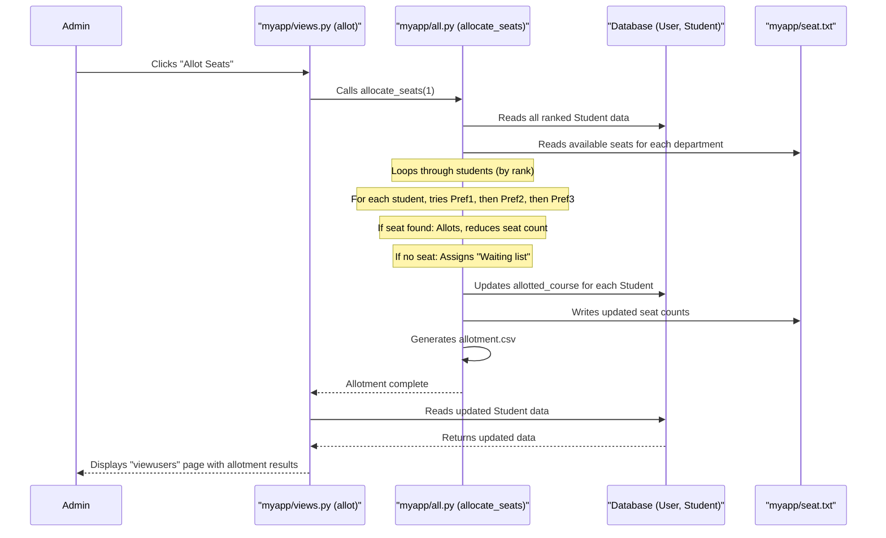

# Chapter 5: Seat Allotment Engine

Welcome back, future engineers! In [Chapter 4: Student Ranking System](04_student_ranking_system_.md), we accomplished a major task: we learned how to assign a unique and fair rank to every student applicant in our `Engineering-Seat-Allocation` project. Now, we have a perfectly ordered queue of students, from Rank 1 to the last.

But what's next? A rank is great, but students still need actual courses! That's exactly the problem the **Seat Allotment Engine** solves.

### What Problem Does the Seat Allotment Engine Solve? (The Course Matchmaker)

Imagine the Student Ranking System created a line of students, neatly ordered by their eligibility. Now, the **Seat Allotment Engine** is like the "Course Matchmaker" or the "Allocation Officer." Its job is to go down that ranked list, one student at a time, and assign them to their preferred courses, as long as seats are available.

This engine is the **central decision-maker** of our entire project. It considers:

1.  **Student's Rank**: The higher the rank, the earlier a student gets a chance to pick.
2.  **Student's Preferred Courses**: What courses did the student list as their 1st, 2nd, and 3rd choices?
3.  **Available Seats**: How many spots are left in each engineering department (like CSE, IT, ECE)?

It systematically tries to give each student their highest possible preference until all seats are filled, or students who couldn't get a seat are placed on a "waiting list."

### Use Case: Admin Initiates Seat Allotment

Just like generating the rank list, the seat allotment process is triggered by an administrator. This ensures that all preparations (like student registrations and ranking) are complete before seats are assigned.

**How it works:**

1.  An administrator logs into the system.
2.  They navigate to the page showing all registered users and their ranks (e.g., `/viewusers`).
3.  On this page, there's a button, perhaps labeled "Allot Seats."
4.  When the admin clicks this button, our system starts the powerful Seat Allotment Engine, assigning courses to students and updating the available seat counts.

Let's look at the Django `view` function that handles this action:

```python
# File: Project/myapp/views.py (Simplified allot function)
from django.contrib import messages
from django.shortcuts import render
from .models import User # We'll fetch users to display updated status
from .all import allocate_seats # Import our core allotment function!

# function for calling the function which fills the preferences for all students
# and then allotting seats for the candidates    
def allot(request):
    # This line calls our special seat allocation function from all.py
    allocate_seats(1) 
    
    # After allotment, fetch all users again to display updated status
    users = User.objects.all()
    # Check if all ranks are positive (meaning ranking was successful, before allotment)
    all_ranks_positive = all(user.urank > 0 for user in users)
    messages.error(request, 'Seats are Allotted to the candidates !') # Show a success message
    return render(request, "myapp/viewusers.html", {'userdata': users,'all_ranks_positive': all_ranks_positive,'messages': messages.get_messages(request)})
```

**What's happening here?**

*   `def allot(request):`: This is the Django view function (our "receptionist") that gets called when the admin clicks the "Allot Seats" button.
*   `from .all import allocate_seats`: This imports a special Python function named `allocate_seats` from a separate file `all.py`. This `allocate_seats` function contains the entire logic for seat allotment.
*   `allocate_seats(1)`: We call this function. The `1` argument is a signal to the function to perform the seat allocation process.
*   `users = User.objects.all()`: After `allocate_seats(1)` finishes, we fetch all `User` objects from the database again. This (and potentially related `Student` objects) will reflect the newly allotted courses.
*   `return render(...)`: Finally, the view re-displays the `viewusers.html` page, showing the students with their `allotted_course` status.

### How it Works Under the Hood: The Allotment Logic

When `allocate_seats(1)` is called, it performs a series of critical steps to ensure fair and systematic seat allocation.

#### The Journey of Seat Allotment: A Quick Overview



#### Diving into the Code: `all.py`

The core logic of seat allotment resides in the `allocate_seats` function within `Project/myapp/all.py`. Let's break down its key parts:

**Part 1: Preparing Student Data (Fetching/Generating Preferences)**

First, the system needs to get all the student details, especially their preferences. If a student hasn't explicitly filled choices, the system might generate random ones.

```python
# File: Project/myapp/all.py (Simplified - Part 1)
import mysql.connector as sqltor
from myapp.models import User, Student # Our database blueprints
from django.core.exceptions import ObjectDoesNotExist
import random

def allocate_seats(c):
    if c == 1:
        mycon = sqltor.connect(host="localhost", user="root", passwd="", database="mydjangodb")
        cursor = mycon.cursor()
        students = [] # List to hold all student objects for processing

        # Iterate through all registered users (who need seats)
        for us in User.objects.all():
            try:
                # Try to get existing choices for the student
                stu = Student.objects.get(id=us.id) 
                # Create a temporary Student object from fetched data
                temp_student = Student(
                    id=us.id, name=us.uname, rank=us.urank, marks=us.ucutoff,
                    pref1=stu.pref1, pref2=stu.pref2, pref3=stu.pref3,
                    allotted_course=stu.allotted_course
                )
                stu.delete() # Delete old entry to re-insert clean data later
                students.append(temp_student)
            except ObjectDoesNotExist:
                # If no choices exist, generate random ones for demonstration
                dep = ["BME", "IT", "MTECH", "ECE", "EEE", "CSE", "CHEMICAL", "CIVIL", "MECH"]
                # ... (logic to pick 3 unique random preferences) ...
                
                temp_student = Student(
                    id=us.id, name=us.uname, rank=us.urank, marks=us.ucutoff,
                    pref1=random_pref1, pref2=random_pref2, pref3=random_pref3
                )
                students.append(temp_student)
        
        # Save all (new/updated) student preference objects to the database
        for student in students:
            student.save()
        
        # Now, fetch students from DB, sorted by rank for allotment
        cursor.execute("SELECT * FROM student ORDER BY `rank` ASC")
        student_data = cursor.fetchall()
        # ... (rest of the allocation logic) ...
```

**Explanation:**

*   **`User.objects.all()`**: It starts by getting every `User` (applicant) registered in the system.
*   **`try...except ObjectDoesNotExist`**: For each user, it tries to find if they have already submitted their `Student` preferences.
    *   If `Student` preferences *exist*, it loads them.
    *   If `Student` preferences *don't exist* (meaning the student didn't fill out the form), the code generates random preferences for `pref1`, `pref2`, `pref3` for that student. This ensures every student has choices for the allotment.
*   **`stu.delete()` and `student.save()`**: The existing `Student` entries are deleted and then re-inserted. This is a way the project ensures data freshness before allotment.
*   **`SELECT * FROM student ORDER BY rank ASC`**: This is crucial! It fetches all student preference data from the database, but this time, it explicitly orders them by their `rank` (lowest rank first), which is exactly how the allocation engine should proceed.

**Part 2: Loading Available Seats**

The number of seats in each department is stored in a simple text file (`myapp/seat.txt`). The engine needs to read this file to know how many spots are available.

```python
# File: Project/myapp/all.py (Simplified - Part 2)
# ... (previous code) ...

        # Read the content of seat.txt once
        with open("myapp/seat.txt") as f2:
            seats = f2.readlines()
        
        # Process each line to get department name and seat count
        for i in range(len(seats)):
            seats[i] = seats[i].strip().split(",") # Splits "CSE,22" into ["CSE", "22"]
            seats[i][1] = int(seats[i][1])         # Converts "22" to integer 22

        # 'seats' now looks like: [["CSE", 22], ["IT", 21], ...]
        # ... (rest of the allocation logic) ...
```

**Explanation:**

*   `with open("myapp/seat.txt") as f2:`: This opens the `seat.txt` file for reading.
*   `seats = f2.readlines()`: Reads all lines from the file into a list.
*   `seats[i].strip().split(",")`: Each line (e.g., "CSE,22") is cleaned (`strip()`) and then split into a list of two items at the comma.
*   `seats[i][1] = int(seats[i][1])`: The second item (the seat count) is converted from text to a number so we can do calculations.

**Part 3: The Allotment Loop (Core Logic)**

This is the heart of the engine. It goes through each student, in rank order, and tries to allot their preferences.

```python
# File: Project/myapp/all.py (Simplified - Part 3)
# ... (previous code) ...

        for student_row in student_data: # Loop through students, already sorted by rank!
            user_id = student_row[0]  # Student's unique ID
            choices = [student_row[3], student_row[4], student_row[5]]  # Pref1, Pref2, Pref3
            flag = 0 # Helper to check if student got a seat

            # If student already allotted (e.g., from a previous run), skip them
            if student_row[7] not in ['Not allotted', 'Waiting list']:   
                continue
            
            for choice in choices: # Try student's preferences in order
                choice = choice.strip() # Clean preference name

                if flag != 1: # Only allot if not already allotted
                    for j in range(len(seats)): # Loop through available seats
                        if choice == seats[j][0] and seats[j][1] > 0: # Check if choice matches and seats are available
                            print(student_row[1], "has been allotted", choice)   
                            seats[j][1] -= 1 # Reduce available seat count
                            # Update the student's allotted_course in the database
                            cursor.execute("UPDATE student SET allotted_course = %s WHERE id = %s", (choice, user_id))
                            flag = 1 # Mark as allotted
                            break # Move to next student
            
            # Part 4: Handling Waiting List (if no preference could be met)
            if flag == 0:
                print(student_row[1], "has not been allotted (Waiting list)")
                cursor.execute("UPDATE student SET allotted_course = %s WHERE id = %s", ("Waiting list", user_id))

        # Commit all database changes (updates to student.allotted_course)
        mycon.commit()
        # ... (rest of the allocation logic) ...
```

**Explanation:**

*   **`for student_row in student_data:`**: This loop processes students one by one, starting with Rank 1, then Rank 2, and so on, because `student_data` was `ORDER BY rank ASC`.
*   **`choices = [student_row[3], student_row[4], student_row[5]]`**: Extracts the student's three course preferences.
*   **`for choice in choices:`**: Tries `pref1`, then `pref2`, then `pref3`.
*   **`if choice == seats[j][0] and seats[j][1] > 0:`**: This is the core decision! It checks two things:
    1.  Does the student's preferred `choice` match a department in our `seats` list?
    2.  Are there still `seats[j][1]` (more than 0) available in that department?
*   **`seats[j][1] -= 1`**: If a seat is allotted, its count is decreased.
*   **`UPDATE student SET allotted_course = %s WHERE id = %s`**: The student's `allotted_course` in the `student` table in the database is updated with the name of the course they received.
*   **`if flag == 0:`**: If, after checking all three preferences, `flag` is still `0` (meaning no seat was found), the student's `allotted_course` is set to "Waiting list."

**Part 5: Updating Seat File and Generating CSV**

After all students have been processed, the updated seat counts are written back to `seat.txt`, and a final `allotment.csv` report is generated.

```python
# File: Project/myapp/all.py (Simplified - Part 5)
# ... (previous code) ...

        # Write back updated seats to the file
        with open("myapp/seat.txt", "w") as f2:
            for seat in seats:
                f2.write(f"{seat[0]},{seat[1]}\n") # Writes back "CSE,21\n" format

        # Generate a detailed allotment report in CSV format
        with open('myapp/allotment.csv', 'w', newline='') as fp:
            writer = csv.writer(fp)
            writer.writerow(['Username', 'Contact number', 'Cutoff', 'Rank', 'Preference 1', 'Preference 2', 'Preference 3', 'Allotted course'])

            # Fetch student data again (with final allotment status) and write to CSV
            cursor.execute("SELECT * FROM student ORDER BY `rank` ASC")
            final_student_data = cursor.fetchall()
            for student_row in final_student_data:
                writer.writerow([student_row[1], student_row[0], student_row[2], student_row[6], student_row[3], student_row[4], student_row[5], student_row[7]])   
        
        # Ensure the database connection is closed
        cursor.close()
        mycon.close()
```

**Explanation:**

*   **`with open("myapp/seat.txt", "w") as f2:`**: Opens the `seat.txt` file in "write" mode (`"w"`), which overwrites its contents.
*   **`f2.write(f"{seat[0]},{seat[1]}\n")`**: Writes each department's updated name and remaining seat count back to the file.
*   **`with open('myapp/allotment.csv', 'w', newline='') as fp:`**: Creates (or overwrites) a CSV file named `allotment.csv`.
*   **`writer.writerow(...)`**: Writes the header row and then each student's details, including their final `Allotted course`, into the CSV file. This provides a comprehensive report of the allotment.

### Example Output: The `allotment.csv`

The final `allotment.csv` file provides a clear, detailed list of who got which course:

```csv
Username,Contact number,Cutoff,Rank,Preference 1,Preference 2,Preference 3,Allotted course
Siddharth Patel,9824915277,196.50,1,EEE,CIVIL,ECE,EEE
Farhan Khan,9730013083,198.00,2,IT,CSE,CIVIL,IT
Divya Singh,9001513406,197.00,3,ECE,CIVIL,MECH,MECH
Dev Arya,9223109963,196.50,4,IT,CSE,MTECH,IT
Utkarsh Singh,9020058364,188.00,5,CSE,ECE,CIVIL,CSE
# ... (many more students) ...
```

As you can see, the student with Rank 1, "Siddharth Patel," got their first preference "EEE." "Farhan Khan" (Rank 2) got "IT," and so on. The engine systematically fills seats based on rank and preferences.

### Conclusion

The Seat Allotment Engine is the culmination of all the previous steps in our `Engineering-Seat-Allocation` project. It's the intelligent "matchmaker" that takes ranked students and their course preferences, along with available seats, to systematically assign courses. We saw how an admin triggers this process through the `allot` view, and how the `allocate_seats` function in `all.py` meticulously:

1.  Prepares student data and preferences.
2.  Reads available seats from a file.
3.  Iterates through students by rank, allotting courses based on preferences and seat availability.
4.  Updates the database with the allotted course status.
5.  Refreshes the available seat counts.
6.  Generates a comprehensive `allotment.csv` report.

This engine brings fairness and automation to the complex process of college admissions. In the next chapter, we'll take a closer look at how our application consistently talks to the database, ensuring all this data is stored and retrieved reliably, in [Chapter 6: Database Interaction Layer](06_database_interaction_layer_.md)!

[Next Chapter: Database Interaction Layer](06_database_interaction_layer_.md)

---

 <sub><sup>**References**: [[1]](https://github.com/itz-me-pandian/Engineering-Seat-Allocation/blob/1a0dba2424984bbc23ebdfb95b2ed13cd798a0ac/Project/myapp/all.py), [[2]](https://github.com/itz-me-pandian/Engineering-Seat-Allocation/blob/1a0dba2424984bbc23ebdfb95b2ed13cd798a0ac/Project/myapp/allotment.csv), [[3]](https://github.com/itz-me-pandian/Engineering-Seat-Allocation/blob/1a0dba2424984bbc23ebdfb95b2ed13cd798a0ac/Project/myapp/seat.txt), [[4]](https://github.com/itz-me-pandian/Engineering-Seat-Allocation/blob/1a0dba2424984bbc23ebdfb95b2ed13cd798a0ac/Project/myapp/views.py)</sup></sub>