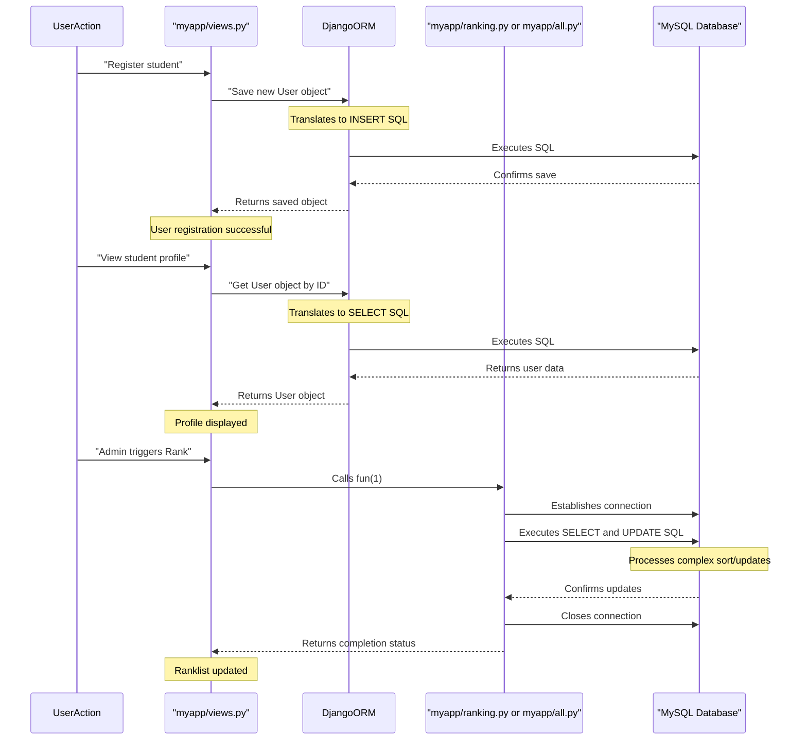

# Chapter 6: Database Interaction Layer

Welcome back, future engineers! In our journey through the `Engineering-Seat-Allocation` project, we've covered a lot. In [Chapter 5: Seat Allotment Engine](05_seat_allotment_engine_.md), we saw how students are allotted courses. But all those important steps – saving student registrations, calculating ranks, and recording allotted courses – involve one crucial thing: talking to our database!

How does our Python application efficiently store and retrieve all this vital information from the MySQL database? That's precisely the role of the **Database Interaction Layer**.

### What Problem Does the Database Interaction Layer Solve? (The Application's Translator)

Imagine you're trying to communicate with someone who speaks a different language. You need a translator! Your Python application speaks Python, but our MySQL database speaks SQL (Structured Query Language). They don't naturally understand each other.

The **Database Interaction Layer** acts as this essential "translator" and "manager." Its job is to:

1.  **Translate Python requests into database commands**: When your Python code wants to "save a new student," this layer converts that into the correct SQL command for the database.
2.  **Translate database responses back into Python**: When the database "finds a student's profile," this layer takes the raw data and turns it into a Python object your application can easily use.
3.  **Manage connections**: It handles the technical details of connecting to and disconnecting from the database.
4.  **Handle data storage and retrieval**: It's the go-between for all the information flowing between your application's logic (in your [Web Request Handling (Views)](02_web_request_handling__views__.md)) and the persistent storage in the database.

Without this layer, your application would have to constantly worry about the complex details of database communication, making the code messy and harder to maintain.

### Two Ways to Talk to the Database

Our `Engineering-Seat-Allocation` project primarily uses two powerful methods within its Database Interaction Layer:

1.  **Django's Object-Relational Mapper (ORM)**: This is like a very smart, built-in translator. It lets you work with database tables as if they were regular Python objects.
2.  **Direct SQL Queries**: Sometimes, for very specific or complex tasks, it's easier to talk directly to the database using raw SQL commands. This is like having an expert who knows SQL perfectly and can execute precise instructions.

Let's explore each method.

#### 1. Django's Object-Relational Mapper (ORM): Working with Python Objects

In [Chapter 3: Django Models (User & Student)](03_django_models__user___student__.md), we learned about Django Models. These models (`User`, `Student`) are the "blueprints" for our database tables. Django's ORM is the engine that brings these blueprints to life!

With the ORM, you don't write SQL queries. Instead, you write Python code that interacts with your models, and the ORM handles the translation to SQL for you.

**Use Case Example: Saving a New Student Registration**

When a new student fills out the registration form, our `insertuser` view function needs to save their details into the `user` table.

```python
# File: Project/myapp/views.py (Simplified from insertuser)
from .models import User # Import our User model

def insertuser(request):
    # ... (extract user details from request.POST) ...
    vuid = request.POST.get('tuid')
    vuname = request.POST.get('tuname')
    vuemail = request.POST.get('tuemail')
    # ... and so on for other fields ...

    # Create a new User object (a Python representation of a database row)
    new_user = User(
        id=vuid,
        uname=vuname,
        uemail=vuemail,
        # ... set other fields like ucaste, uyear, um1, etc. ...
    )
    # Tell Django to save this Python object to the database!
    new_user.save() 
    # ... (rest of the view logic) ...
```

**Explanation:**

*   `new_user = User(...)`: We create an instance of our `User` model, just like creating any other Python object. We pass it the data we want to save.
*   `new_user.save()`: This is the magic of the ORM! When you call `.save()` on a model object, Django's ORM automatically generates the correct `INSERT` SQL statement and executes it against the database, creating a new row in the `user` table. You didn't write any SQL yourself!

**Use Case Example: Fetching a Student's Profile**

When a user logs in or an admin wants to view a specific student's profile, the `view` function needs to retrieve their data.

```python
# File: Project/myapp/views.py (Simplified from view)
from django.shortcuts import get_object_or_404
from .models import User # Import our User model

def view(request, id): # 'id' comes from the URL (e.g., /viewprofile/1234567890)
    # Use the ORM to find one User object where its 'id' field matches the given 'id'
    # get_object_or_404 is a shortcut that finds the object or shows a 404 error
    user_profile = get_object_or_404(User, id=id) 
    
    # The 'user_profile' variable now holds a Python object with all the user's data
    context = {'user': user_profile} 
    return render(request, "myapp/viewprofile.html", context)
```

**Explanation:**

*   `User.objects.get(id=id)` (simplified by `get_object_or_404`):
    *   `User.objects`: This is Django's **Manager**, the main way to interact with the database through the ORM.
    *   `.get(id=id)`: This tells the Manager to find *one* `User` object where the `id` field in the database table matches the `id` value provided. The ORM translates this into a `SELECT * FROM user WHERE id = ...` SQL query.
*   The `user_profile` variable then holds a `User` Python object, making it easy to access data like `user_profile.uname`, `user_profile.uemail`, etc., in your Python code and templates.

#### 2. Direct SQL Queries: Talking Directly to the Database

While Django's ORM is incredibly convenient, there are situations where you might need more fine-grained control or have a very complex query that's hard to express with the ORM. In these cases, our project sometimes uses direct SQL queries.

This method typically involves using a library like `mysql.connector` to establish a direct connection to the database and then executing raw SQL strings.

**Use Case Example: Updating Student Ranks in Batch**

In [Chapter 4: Student Ranking System](04_student_ranking_system_.md), we saw how the `ranking.py` file calculates and updates the `urank` for *all* students. This process involves fetching all users, sorting them by various criteria, and then updating their ranks. The project uses direct SQL for this to ensure efficient, batch updates.

```python
# File: Project/myapp/ranking.py (Simplified for rank update)
import mysql.connector as sqltor # Library for direct MySQL connection

def fun(c):
    if c == 1:
        mycon = sqltor.connect(host="localhost", user="root", passwd="", database="mydjangodb")
        cursor = mycon.cursor()

        # Step 1: Select and order all users by ranking criteria
        select_query = """
        SELECT id, urank FROM user 
        ORDER BY unvalue DESC, um1 DESC, um2 DESC, utotal DESC, uyear ASC, uname ASC
        """
        cursor.execute(select_query)
        sorted_users_data = cursor.fetchall() # Get all sorted user data

        current_rank = 0
        for user_row in sorted_users_data:
            current_rank += 1
            user_id = user_row[0] # The user's ID
            
            # Step 2: Directly execute SQL to update the rank for each user
            update_query = "UPDATE user SET urank = {} WHERE id = {}".format(current_rank, user_id)
            cursor.execute(update_query)

        mycon.commit() # Save all changes to the database
        mycon.close()
```

**Explanation:**

*   `import mysql.connector as sqltor`: This imports the library that allows Python to connect directly to MySQL.
*   `mycon = sqltor.connect(...)`: Establishes a direct connection to our MySQL database.
*   `cursor = mycon.cursor()`: Creates a "cursor" object, which is used to execute SQL commands.
*   `cursor.execute(select_query)`: Executes the raw `SELECT` SQL query to get all user data, already sorted by the complex ranking rules.
*   `cursor.execute(update_query)`: Inside the loop, for each student, a direct `UPDATE` SQL statement is constructed and executed to set their `urank`.
*   `mycon.commit()`: This is crucial! It saves all the changes made by the `UPDATE` statements permanently to the database. Without it, changes might not be saved.

**Use Case Example: Updating Allotted Course**

Similarly, in [Chapter 5: Seat Allotment Engine](05_seat_allotment_engine_.md), after deciding which course a student receives, the `all.py` file updates the `allotted_course` field in the `student` table using direct SQL.

```python
# File: Project/myapp/all.py (Simplified for allotted course update)
import mysql.connector as sqltor 

def allocate_seats(c):
    if c == 1:
        mycon = sqltor.connect(host="localhost", user="root", passwd="", database="mydjangodb")
        cursor = mycon.cursor()
        # ... (logic to determine student_id and their allotted_course) ...

        # Example: if a student with user_id '123' is allotted 'CSE'
        user_id = '123'
        allotted_course = 'CSE'

        # Directly execute SQL to update the student's allotted course
        update_query = "UPDATE student SET allotted_course = %s WHERE id = %s"
        cursor.execute(update_query, (allotted_course, user_id)) # Parameters are passed safely
        
        mycon.commit()
        mycon.close()
```

**Explanation:**

*   This works very similarly to the `ranking.py` example, using `cursor.execute()` with an `UPDATE` SQL statement to directly modify the `student` table.
*   `%s` placeholders are used, and the actual values are passed as a tuple to `cursor.execute()`. This is a good practice to prevent SQL injection vulnerabilities.

### Why Use Both?

You might wonder, why not just use one method?

| Feature            | Django ORM                                               | Direct SQL (using `mysql.connector`)                     |
| :----------------- | :------------------------------------------------------- | :------------------------------------------------------- |
| **Ease of Use**    | Very high, uses Python objects and methods.             | Moderate, requires knowing SQL syntax.                  |
| **Readability**    | Excellent, Python code describes the action.            | Good for those familiar with SQL.                       |
| **Portability**    | High, Django can work with different databases (MySQL, PostgreSQL, SQLite) by changing settings, ORM code often stays the same. | Low, SQL syntax can vary slightly between database types. |
| **Complexity**     | Best for common Create, Read, Update, Delete (CRUD) operations. | Excellent for complex joins, aggregations, or specific database features. |
| **Performance**    | Generally good for most tasks.                           | Can be optimized for very specific, performance-critical queries. |
| **Project Usage**  | Used in `views.py` for typical user operations (registration, profile view, choice saving). | Used in `ranking.py` and `all.py` for batch updates and complex sorting logic. |

Our project leverages both: the ORM for most day-to-day interactions (like saving a single user or fetching a profile) and direct SQL for specialized, batch operations like the ranking and seat allotment, where precise control over the database queries is beneficial.

### Under the Hood: The Data's Journey

Let's visualize how these two methods direct our application's data.



### Conclusion

The Database Interaction Layer is the unsung hero of our `Engineering-Seat-Allocation` project, allowing our Python application to seamlessly store, retrieve, and manipulate data in the MySQL database. We explored two primary ways this layer functions:

*   **Django's ORM**: Which lets us work with Python objects and handles the SQL translation automatically for common tasks like saving new registrations or fetching user profiles.
*   **Direct SQL Queries**: Employed in modules like `ranking.py` and `all.py` for complex, batch-oriented operations like student ranking and seat allotment, where direct control over SQL commands offers efficiency and flexibility.

Understanding this layer is crucial, as it underpins all data persistence in our application, ensuring that student details, ranks, and course allotments are reliably managed.

This concludes our tutorial journey through the `Engineering-Seat-Allocation` project! We hope you've gained a foundational understanding of how this web application works from routing requests to allocating seats.

---

<sub><sup>**References**: [[1]](https://github.com/itz-me-pandian/Engineering-Seat-Allocation/blob/1a0dba2424984bbc23ebdfb95b2ed13cd798a0ac/Project/myapp/all.py), [[2]](https://github.com/itz-me-pandian/Engineering-Seat-Allocation/blob/1a0dba2424984bbc23ebdfb95b2ed13cd798a0ac/Project/myapp/data.py), [[3]](https://github.com/itz-me-pandian/Engineering-Seat-Allocation/blob/1a0dba2424984bbc23ebdfb95b2ed13cd798a0ac/Project/myapp/models.py), [[4]](https://github.com/itz-me-pandian/Engineering-Seat-Allocation/blob/1a0dba2424984bbc23ebdfb95b2ed13cd798a0ac/Project/myapp/ranking.py), [[5]](https://github.com/itz-me-pandian/Engineering-Seat-Allocation/blob/1a0dba2424984bbc23ebdfb95b2ed13cd798a0ac/Project/myapp/views.py), [[6]](https://github.com/itz-me-pandian/Engineering-Seat-Allocation/blob/1a0dba2424984bbc23ebdfb95b2ed13cd798a0ac/Project/mydjangosite/settings.py)</sup></sub>