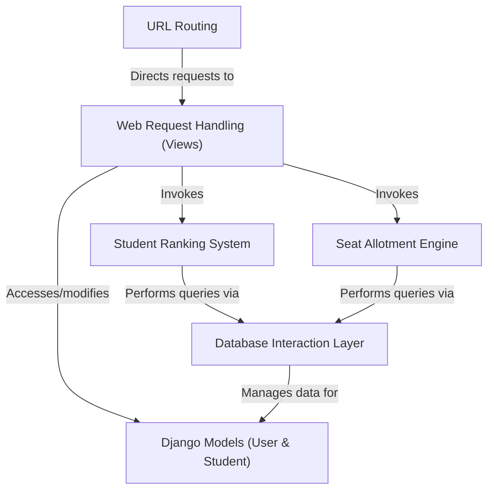

# AllotEasy : Engineering-Seat-Allocation

This project is an **online admission system** for engineering seats. It allows *students to register* with their academic details, *calculates their merit ranks*, and enables them to *choose their preferred courses*. Finally, an automated engine *allots seats* to students based on their ranks and choices, with administrators overseeing the entire process through a web interface.

## Visual Overview

## Chapters

1. [URL Routing](readme_files/01_url_routing_.md)
2. [Web Request Handling (Views)](readme_files/02_web_request_handling__views__.md)
3. [Django Models (User & Student)](readme_files/03_django_models__user___student__.md)
4. [Student Ranking System](readme_files/04_student_ranking_system_.md)
5. [Seat Allotment Engine](readme_files/05_seat_allotment_engine_.md)
6. [Database Interaction Layer](readme_files/06_database_interaction_layer_.md)

---

© 2025 [Pandiarajan D](https://github.com/itz-me-pandian). Educational Purpose.
